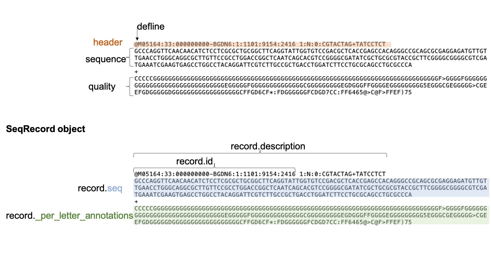
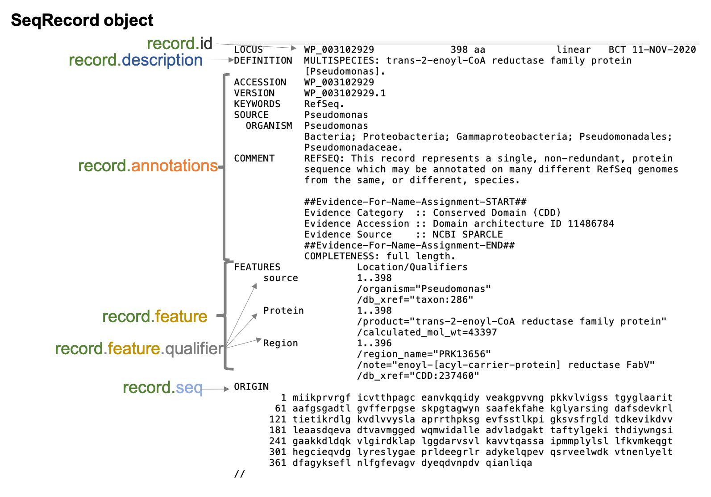

# Biopython: Work with biological sequence data in Python
 
Welcome to this Biopython workshop! 

We will learn how to use Biopython for sequence manipulation, filtering, writing, and BLASTing!

# Running workshop code

There are three options to run the workshop code:

1. Click on the desired workshop day link in the [files section](#Files)

2. Open the main github directory in [google colab](https://colab.research.google.com/github/agmcfarland/biopython_workshop/blob/main/) and select the notebook (.ipynb) you wish to run. 

3. click on the green Code button and choose Download Zip, unzip the folder on your computer, open Jupyter Lab (through Anaconda Navigator or the command line), navigate to the folder you just downloaded, and open the appropriate notebook.

# Lesson overview 

1. Monday – Introduction to strings, Biopython, and Biopython sequences

2. Tuesday – Opening, closing, and saving sequence files with Biopython

3. Wednesday – More sequence modification and data extraction

4. Thursday – Extracting and storing sequence data, working with GenBank files

5. Friday – BLAST and converting between file types

# Files

In the main directory you will find lesson notebooks, answer notebooks, example data, and annotated images.

## Lesson Notebooks

There are five jupyter notebooks, one for each day

1. [Lesson Day 1](https://colab.research.google.com/github/agmcfarland/biopython_workshop/blob/main/day_1.ipynb)

2. [Lesson Day 2](https://colab.research.google.com/github/agmcfarland/biopython_workshop/blob/main/day_2.ipynb)

3. [Lesson Day 3](https://colab.research.google.com/github/agmcfarland/biopython_workshop/blob/main/day_3.ipynb)

4. [Lesson Day 4](https://colab.research.google.com/github/agmcfarland/biopython_workshop/blob/main/day_4.ipynb)

5. [Lesson Day 5](https://colab.research.google.com/github/agmcfarland/biopython_workshop/blob/main/day_5.ipynb)

## Answer Notebooks

There are five jupyter notebooks, one for each day, with the **answers** to all the exercises in the lessons

1. [Answers Day 1](https://colab.research.google.com/github/agmcfarland/biopython_workshop/blob/main/answers_day_1.ipynb)

2. [Answers Day 2](https://colab.research.google.com/github/agmcfarland/biopython_workshop/blob/main/answers_day_2.ipynb)

3. [Answers Day 3](https://colab.research.google.com/github/agmcfarland/biopython_workshop/blob/main/answers_day_3.ipynb)

4. [Answers Day 4](https://colab.research.google.com/github/agmcfarland/biopython_workshop/blob/main/answers_day_4.ipynb)

5. [Answers Day 5](https://colab.research.google.com/github/agmcfarland/biopython_workshop/blob/main/answers_day_5.ipynb)

## Data

Different data files of extension .fasta, .gbk, and .xml

## Annotated images

Examples of biological sequence data types and how Biopython reads them. Useful companion for lessons.

### Fasta

### Fastq

### GenBank

### BLAST

# Credit and references

[Alexander McFarland](https://twitter.com/alexmcfarland_)

[Biopython](https://biopython.org/)

[Northwestern University Information Technology Research Computing Services](https://github.com/nuitrcs)

Special thanks to [Colby Witherup Wood](https://github.com/aGitHasNoName) for their assistance
